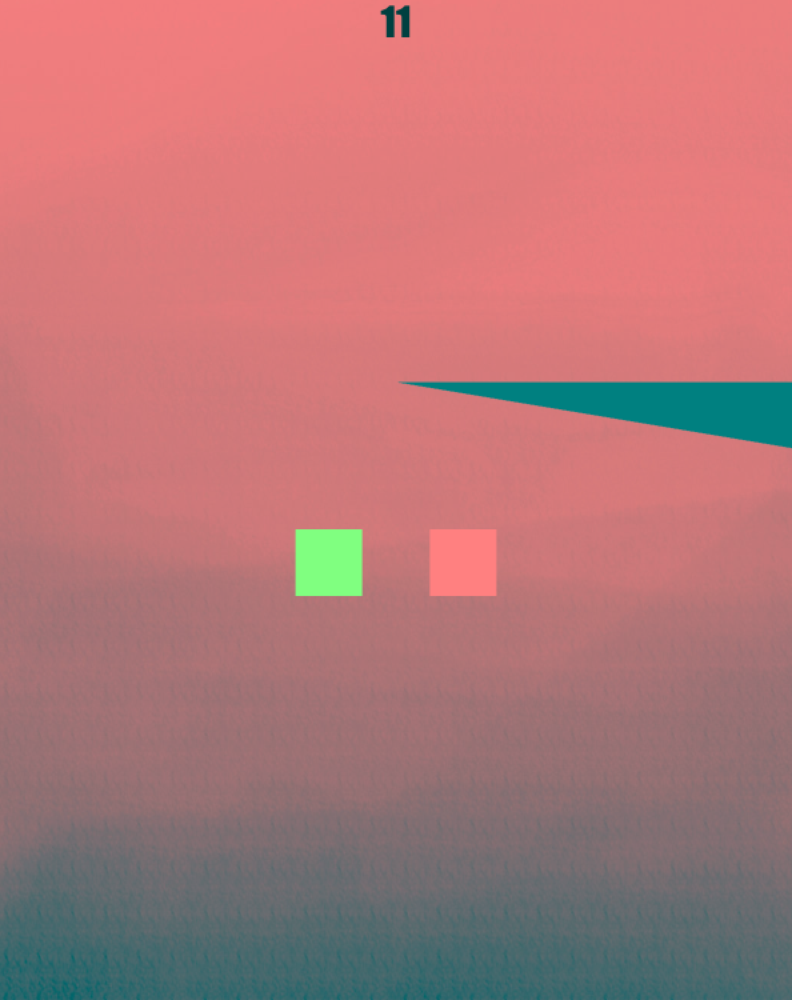

# SHREDD

**Author**: Alice Huang - [`aliceh4@illinois.edu`](mailto:aliceh4@illinois.edu)

## How it works
This project will be a take on the game SHREDD. To see how the game works, look at PROPOSAL.md. Essentially, the user presses the arrow keys on the keyboard to navigate through spikes. 

The above image shows what the game looks like when the program is run.

## Dependencies

- [cmake](https://cmake.org/)
- [catch2](https://github.com/catchorg/Catch2)
- [Box2D](https://box2d.org/)
- [Cinder](https://libcinder.org/)

### Box2D

- This project uses [Box2D](https://box2d.org/). The CMakeLists.txt file already has the code necessary to add this library to the project since Box2D is a CinderBlock.

## How to run SHREDD

- You must have a C++ IDE like [CLion](https://www.jetbrains.com/clion/) or [Visual Studio](https://visualstudio.microsoft.com/) installed.
- After properly setting up the IDE, download [Cinder](https://libcinder.org/) for your platform. Extract the downloaded item into a folder. Make sure you build this folder in your IDE before moving on.
- Make a new directory in your Cinder folder. Clone this project into this new directory.
- Open this project in your IDE and set the target to cinder-myapp. The project should work correctly now and can be run.
