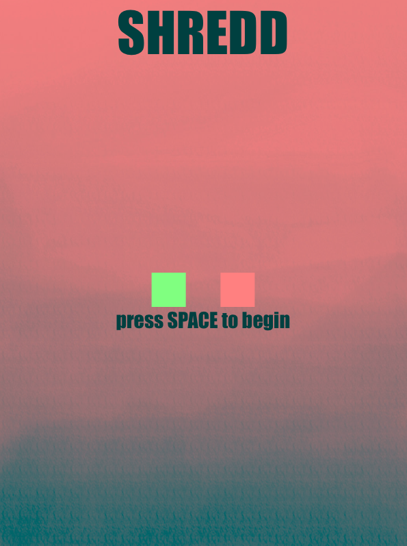

# SHREDD

**Author**: Alice Huang - [`aliceh4@illinois.edu`](mailto:aliceh4@illinois.edu)

## How it works
This project will be a take on the game SHREDD. To see how the game works, look at PROPOSAL.md. Essentially, the user presses the arrow keys on a keyboard to navigate through spikes. 

Home Screen                |  Game Screen
:-------------------------:|:-------------------------:
 |  

The above images show what the homescreen and gamescreen look like when the program is run.

## Dependencies

- [cmake](https://cmake.org/)
- [catch2](https://github.com/catchorg/Catch2)
- [Box2D](https://box2d.org/)
- [Cinder](https://libcinder.org/)

### Box2D

- This project uses [Box2D](https://box2d.org/). The CMakeLists.txt file already has the code necessary to add this library to the project.

## How to run SHREDD

- Must have an IDE like [CLion](https://www.jetbrains.com/clion/) or [Visual Studio](https://visualstudio.microsoft.com/).
- After properly setting up the IDE, download [Cinder](https://libcinder.org/) for your platform. Extract the downloaded item into a folder. Make sure you build this folder in your IDE.
- Make a directory in your Cinder folder. Clone this project into this new directory.
- Open this project in your IDE and set the target to cinder-myapp and then the project should run.
